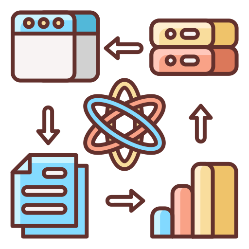
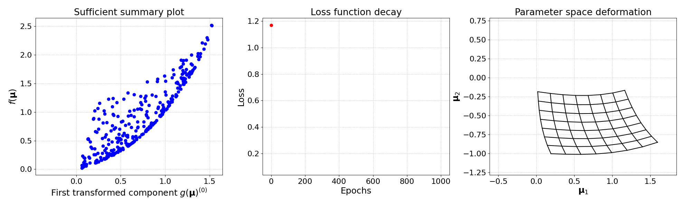

<h1 align="center">👋 What's shakin'? I'm here AHAHAHAHAHA 👋 (refferences 😐)</h1>
<h3 align="center">I'm CSFelix, a passionate Programmer and Student from Brazil</h3>

 
   
  

- 💬 Ask me about **Python, Machine Learning and Data Science.**

 

- 🤔 Nowadays, I share public projects here and in my Personal Portfolio, which you can check out here: [CSFelix.io](https://csfelix.github.io/index.html).

 

- 🔭 I'm currently working on **Data Science projects (Machine and Deep Learning), Node JS, React and React-Native.**

  

----

<h3 align="left">🏆 Trophies 🏆</h3>

  

----

<h3 align="left">📇 Connect with me 📇</h3>

----

<h3 align="left">💼 Working For 💼</h3>

----

<h3 align="left">🏢 Organizations 🏢</h3>

ㅤ

ㅤ

----

<h3 align="left">⌨️ Languages and Tools ⌨️</h3>

----

<h3 align="left">💻 Account Stats 💻</h3>

 

  
    
  
    
  

----

<h3 align="left">🌟 Fav Repos 🌟</h3>

Favorite Web Repo          |  Favorite Python Repo
:-------------------------:|:-------------------------:
  |  

Favorite Java Repo         |  Favorite C# Repo
:-------------------------:|:-------------------------:
  | 

 

  

----

<h3 align="left">🍺 Support 🍺</h3>

    
  

----

<h3 align="left">📊 Data Science for Everyone 📊</h3>

